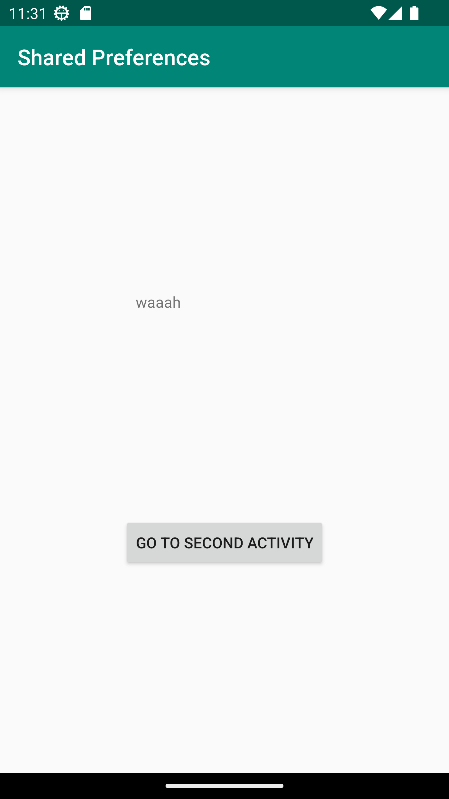
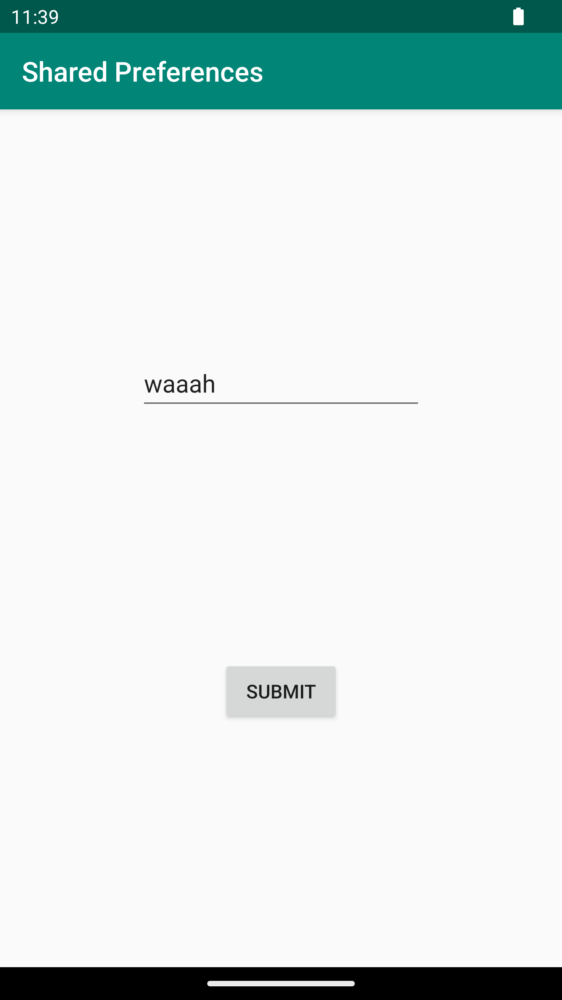

#Rapport

Det första som gjordes var att skapa en till activity. I MainActivity så sattes en TextView och en knapp och 
i SecondActivity så sattes en editText och en knapp. För att kunna gå emellan sidorna så användes intents som 
öppnar den ena Activiteten från den andra. 

I Kod 1 så visas koden som sätter upp variablerna för shared preferences i MainActivity och skriver ut 
texten som är lagrad i en TextView. setText i Kod 1 blocket skriver ut det i shared preference varaibeln 
när appen startar och Kod 2 skriver ut den när använder går tillbaka till MainActivity från SecondActivity.

I Kod 3 så visas koden som sparar texten som användaren skrivit i en shared preference. Funktionen store() 
kallas när användaren klickar på knappen i SecondActivity.

I Bild 1 så visas den färdiga MainActivity sidan och i Bild 2 så visas den färdiga SecondActivity sidan. 

```
private SharedPreferences myPreferenceRef;
private SharedPreferences.Editor myPreferenceEditor;
protected void onCreate(Bundle savedInstanceState) {
    [...]
    myPreferenceRef = getSharedPreferences("key", MODE_PRIVATE);
    myPreferenceEditor = myPreferenceRef.edit();
    TextView prefTextRef= findViewById(R.id.textView);
    prefTextRef.setText(myPreferenceRef.getString("key", "No preference found."));
    [...]
}
```
Kod 1: Sätter upp preferences i MainActivity

```
@Override
protected void onResume() {
    super.onResume();
    TextView sharedPrefData = findViewById(R.id.textView);
    sharedPrefData.setText(myPreferenceRef.getString("key", "Name"));
}
```
Kod 2: Läser preferences i MainActivity

```
void store() {
        EditText sharedPrefData = findViewById(R.id.editTextTextPersonName);
        myPreferenceEditor.putString("key", sharedPrefData.getText().toString());
        myPreferenceEditor.apply();
    }
```
Kod 3: Skriver till preferences i SecondActivity


Bild 1: MainActivity sidan


Bild 2: SecondActivity sidan
